---
aliases:
  - Burp
  - Burp Suite
  - burp suite
---

# Burp Suite
Init.
## Burp Proxy
The [proxy](../../../../networking/design-structure/proxy.md) tool intercepts requests and responses between the Burp browser (or whatever browser you configure it to proxy through) and the target wep application/ host. It allows you to not only read requests and responses but also to *modify requests* before they're sent to the target.
### Setting up a proxy
Usually, Burp starts and is pre-configured to use its built-in browser as the proxy. You can see this if you go to Settings --> Proxy. The 'Proxy Listener' will likely be set to `127.0.0.1:8080`. This means that when you open Burp's Browser, the traffic Burp sends to whatever host you visit in the browser will be sent Burp's listener on your [loopback](../../../../networking/routing/loopback.md) interface (on port 8080). 

You can configure Burp to use a different browser, such as Firefox, by configuring Firefox to do that. For example, if you have the Firefox extension "Firefox Multi-Account Containers", you can create a new container and edit its proxy settings. Let's say you edit the proxy settings to "http://localhost:44444", then in BurpSuite, just add `127.0.0.1:44444` as a listener and voila.
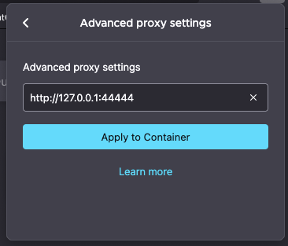
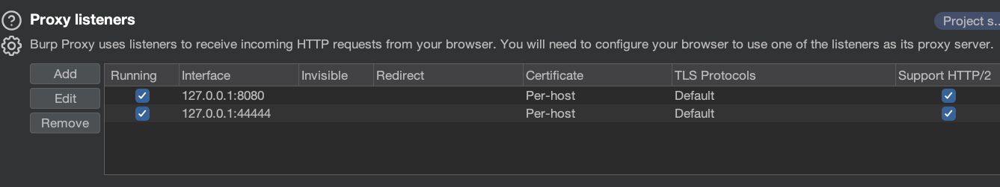
## Using a Macro with Intruder (Bypassing CSRF)
> [!Note]
> This is very specific, sorry. I had to figure this out and wanted to note it so I don't have to re-figure it out when I need it again in the future.
### What is a Macro
Burp Macros are rules you can set which will manipulate requests you send based on a set of conditions you give it. For example, you can use a Macro to *bypass [CSRF](../CSRF.md)* by designing a macro to fetch the CSRF token on an input form and apply it in you current request. 
### Example Scenario
You come across a login form on the target site with user enumeration. When you put the username into the username field, and then press "Forgot Password" the website responds with an error message:

So, you want to enumerate valid users by leveraging Burp's Intruder tool (to send a bunch of POST requests to the Forgot Password endpoint (`/authentication/reset`) with different usernames until one of them triggers a different response - indicating that user exists). However, upon loading your request in Intruder, you notice it requires a CSRF token:

Looking back at the origin GET request for the login page, you notice the input [HTML](../../../bug-bounties/hackerone/hacker101/HTML.md) element in the form where the `m2csrf` value likely came from: 
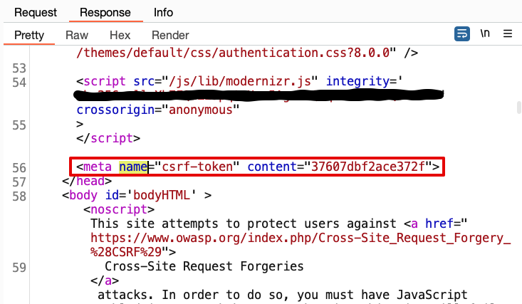
This sucks because how are you going to use Intruder to send a bunch of requests *if each request's `m2csrf` parameter has to match the `csrf-token` value of the form?*. Welp, you can use a Macro!
### Setting up a Macro
Go to Settings --> Project --> Sessions, and then the section titled "Macros" (this might change in the future but here's how it looks on my current Burp Suite window):

Click "Add". A list of recent requests will show up. Find the GET request for the portal login page:
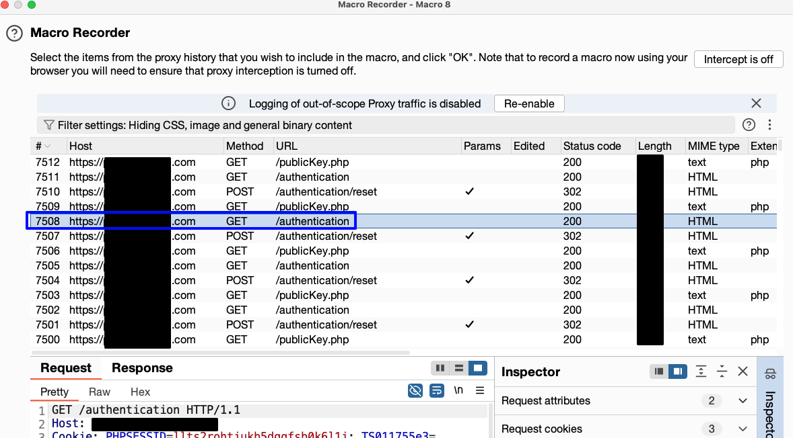
(Notice that I'm purposefully *not choosing the POST request to `/authentication/reset`)*. Once you've selected the request you want, click "OK". 
#### Configure the Macro
On the next pop-up screen, click "Configure item." Give the macro a name if you like, here it's named "Macro 8:"
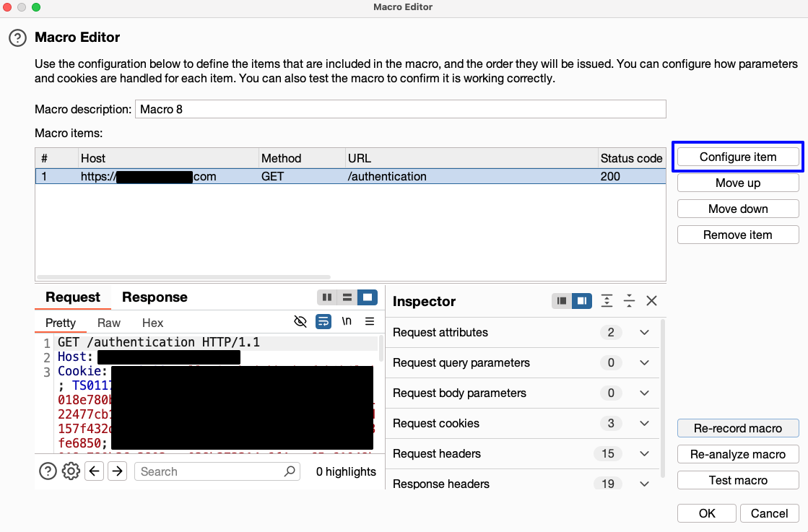
Then click "Add":
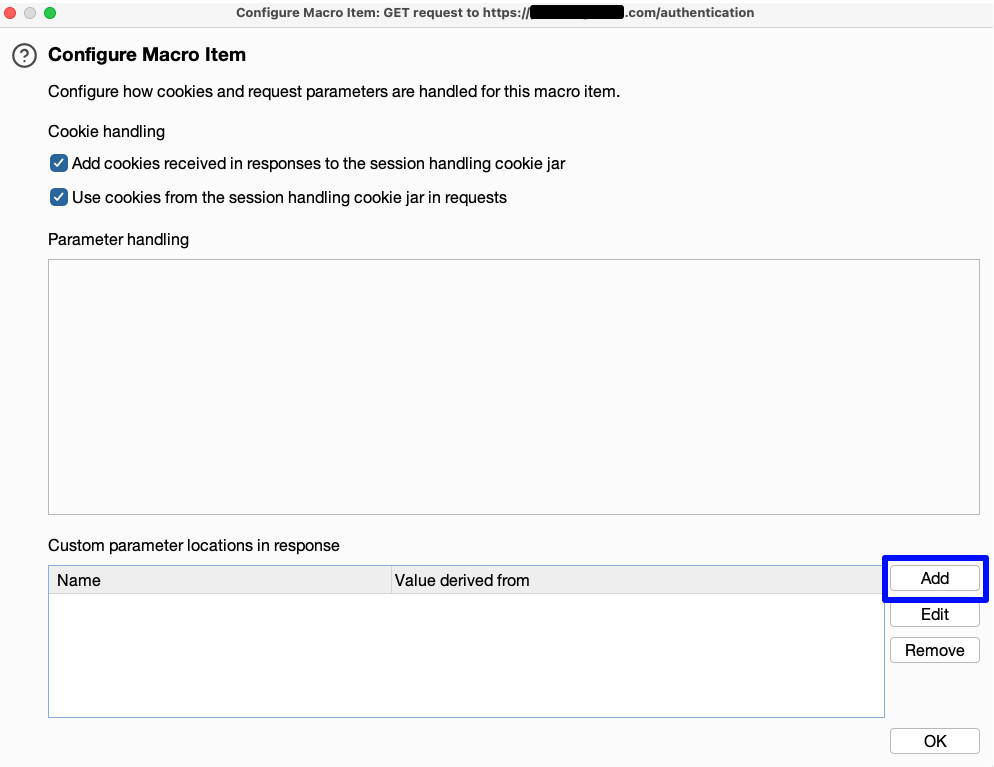
Now you should be in the "Define Custom Parameter" window. In this window:
- Set the "Parameter Name" value to the name of the parameter in the POST request that you want to change the value to. In this example, that would be `m2csrf`
- Use the request previewed at the bottom of the window to find the input value in the response you want to set the parameter to
- Set "Start after expression" to a unique value which matches the text *before the input value*. Burp is going to use this to find the value in each response so make sure it's unique
- Set "End at delimeter" to whatever value in the request *comes after* the value you want Burp to capture
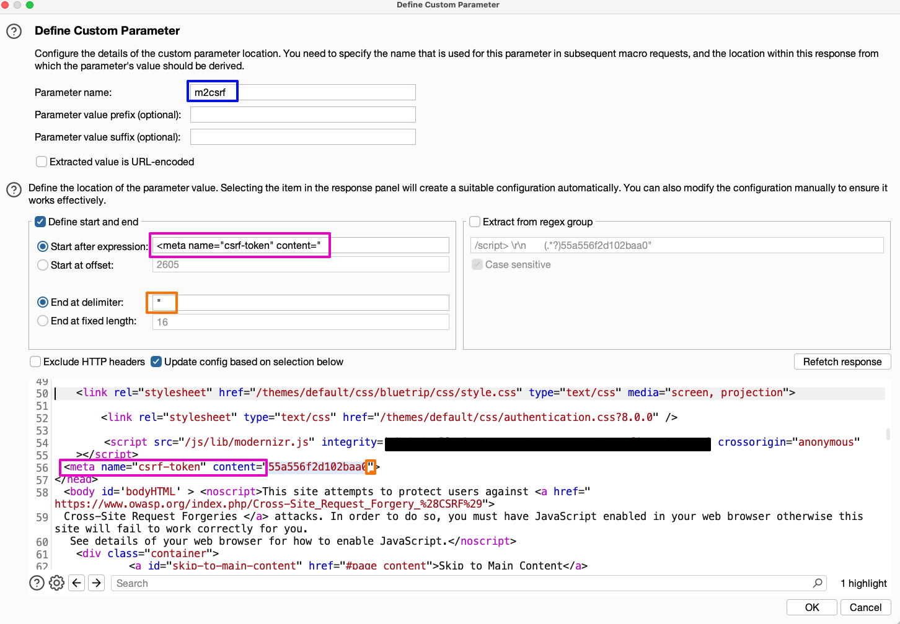
If you do the delimiters correctly, your target value should be highlighted in the request. Press "OK" once you've configured it correctly. Once you do, you'll be back to the "Configure Macro Item" window. Press "OK" again. Now you should be back in the "Macro Editor." Click "OK" one more time to close the Macro Editor.
### Adding the Macro to a Session Handling Rule
Back in the Settings window, go to the "Session handling rules" section and click "Add," you should see a window like this:
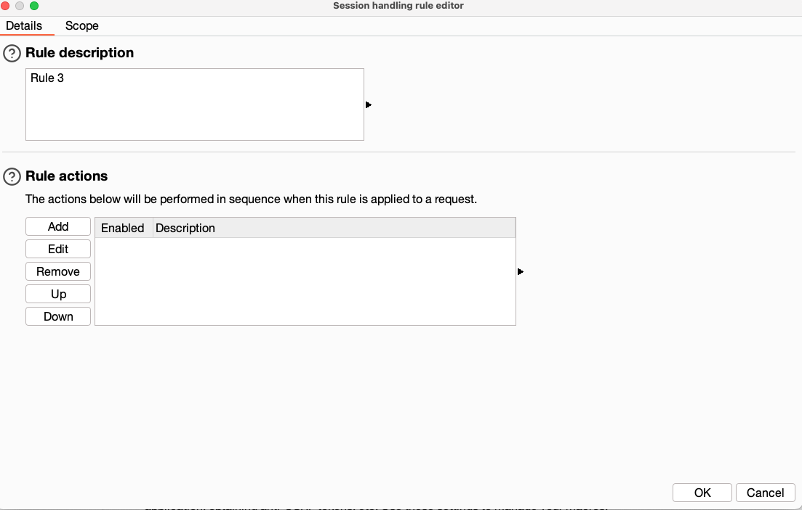
Under "Rule Actions" click "Add" and you should get a drop down of options. Choose "Run a macro"
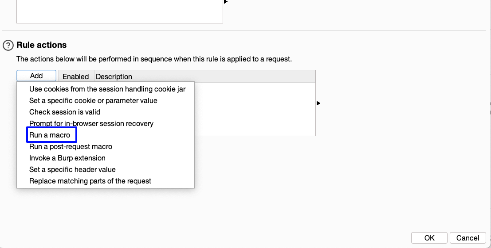
In the pop-up choose the macro you just created (Macro 8 in this case). Here you can also configure how you want the value fetched by the Macro to applied to requests. In this case, I'm choosing to update only request parameters with the name "m2csrf." Click "OK" once you're done.
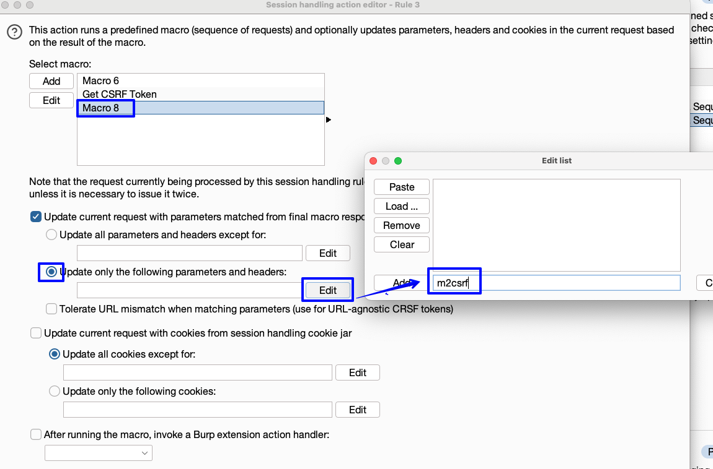
Back in the "Session handling rule editor" click the "Scope" tab so you can fine-grain how this rule is applied to requests. Choose which tools you want this to be applied to and which URLs. Add the URL *of the POST request* (in our example `host.com/authentication/reset`):
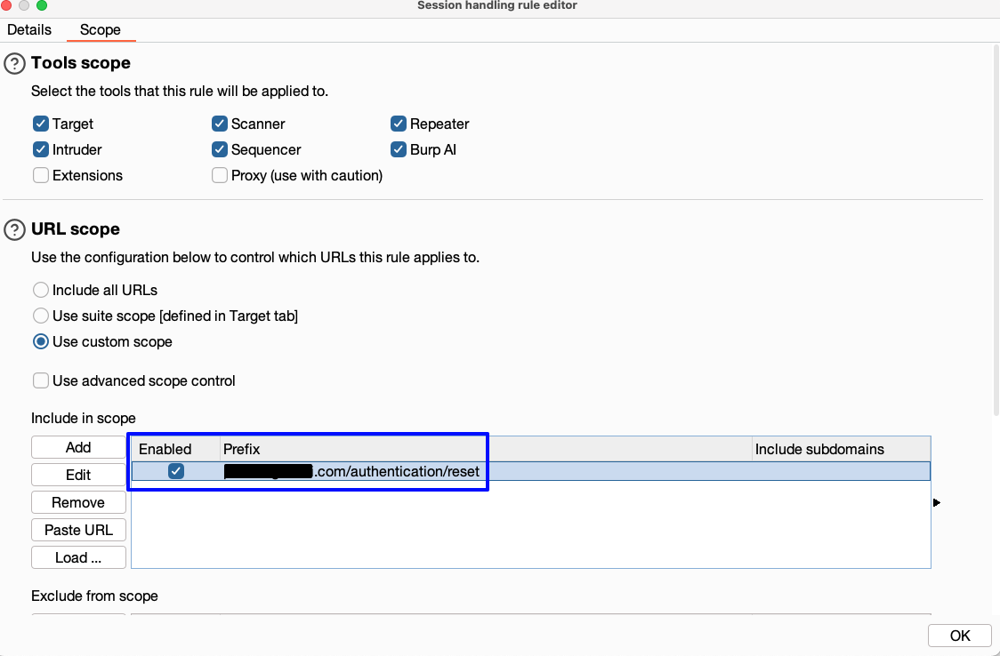
Once you've added your options, click "OK."
### Testing your Macro + Session Rule
Now back in the settings window click "Open sessions tracer." This will open a window which will log all of the requests where the session rule and macro were triggered. With the window open, use Repeater to send the original POST request (to `/authentication/reset` in this case) which includes the parameter you want the Macro to change for you. Once you send the request, you should see it populate into the session tracer window:
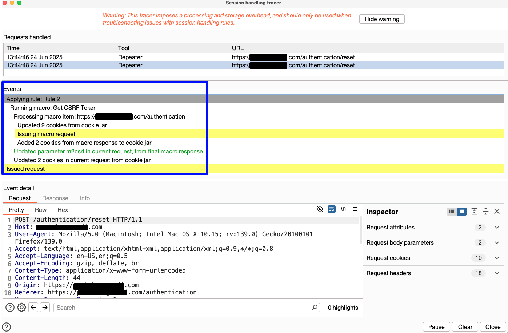
Click through the events in the Events section to see how the Macro and rule changed your requests. You'll probably have to send the request twice to trigger the change.

Once you're sure the Macro is working, you can enumerate the requests with Intruder and it will update the CSRF token for each request!

> [!Resources]
> - my bren
> - [Numen Cyber Labs: Using Burp Suite to Bruteforce Anti CSRF token-based forms](https://medium.com/numen-cyber-labs/using-burp-suite-to-bruteforce-anti-csrf-token-based-forms-f0832fe147c1)
> - [Stack Exchange Question: Using Macros with Intruder](https://security.stackexchange.com/questions/170200/how-to-use-burp-macros-to-pass-parameters-to-intruder)