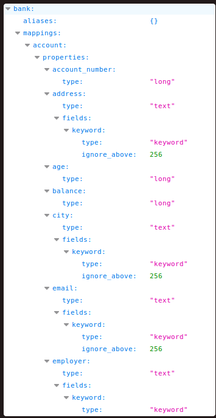

# Elasticsearch
> Elasticsearch is a **distributed**, **open source** search and analytics engine for **all types of data**. It is known for its **speed**, **scalability**, and **simple REST APIs**. Built on Apache Lucene, it was first released in 2010 by Elasticsearch N.V. (now known as Elastic). Elasticsearch is the core component of the Elastic Stack, a collection of open source tools for data ingestion, enrichment, storage, analysis, and visualization. This stack, commonly referred to as the ELK Stack, also includes Logstash and Kibana, and now has lightweight data shipping agents called Beats.

-[HackTricks](https://book.hacktricks.xyz/network-services-pentesting/9200-pentesting-elasticsearch)
## Elasticsearch Index
> [!Info]
> [TCP](../../../networking/protocols/TCP.md) port `9200`

A collection of related documents stored as *[JSON](../../../coding/data-structures/JSON.md)* w/ each document consisting of *key value pairs*. Elasticsearch uses a data structure called a *inverted index* which makes it fast at searching text. 
### Inverted Index
The index lists every unique word in a document and then identifies all documents with the same word. In Elasticsearch *only text data is stored using inverted indices*. Elasticsearch also provides an *Index API* which can be used to update JSON documents w/ a specific index.

-[Victor Lavrenko](https://www.youtube.com/watch?v=bFrO8piASKg)
## Authentication
By default *Elasticsearch has authentication disabled*, meaning you can access *everything in the database w/o creds*. To verify auth is disabled, you can use [curL](../../../CLI-tools/linux/remote/curL.md) w/ a `GET` request:
```bash
curl -X GET "ELASTICSEARCH-SERVER:9200/_xpack/security/user"
{"error":{"root_cause":[{"type":"exception","reason":"Security must be explicitly enabled when using a [basic] license. Enable security by setting [xpack.security.enabled] to [true] in the elasticsearch.yml file and restart the node."}],"type":"exception","reason":"Security must be explicitly enabled when using a [basic] license. Enable security by setting [xpack.security.enabled] to [true] in the elasticsearch.yml file and restart the node."},"status":500}
```
If the server does have authentication enabled, a `GET` request to `/` will return:
```bash
{"error":{"root_cause":[{"type":"security_exception","reason":"missing authentication credentials for REST request [/]","header":{"WWW-Authenticate":"Basic realm=\"security\" charset=\"UTF-8\""}}],"type":"security_exception","reason":"missing authentication credentials for REST request [/]","header":{"WWW-Authenticate":"Basic realm=\"security\" charset=\"UTF-8\""}},"status":401}
```
In this case, you need valid credentials.
`curl -X GET http://user:password@<target IP>:9200/`
## Enumeration
To access Elasticsearch you have to use [HTTP](../../../www/HTTP.md) at port `9200`. Doing so on a target will bring you to the *Banner page* which has a lot of interesting information on it:
`http://<target IP>:9200/`

### Listing roles
```bash
#List all roles on the system:
curl -X GET "ELASTICSEARCH-SERVER:9200/_security/role"
```
### List users
```bash
#List all users on the system:
curl -X GET "ELASTICSEARCH-SERVER:9200/_security/user"
```
### List User rights
```bash
#Get more information about the rights of an user:
curl -X GET "ELASTICSEARCH-SERVER:9200/_security/user/<USERNAME>"
```
### Elasticsearch Server Info
This is a list of endpoints which will give you more information about the server itself if you query using `GET`:

| _cat                          | /_cluster                    | /_security              |
| ----------------------------- | ---------------------------- | ----------------------- |
| /_cat/segments                | /_cluster/allocation/explain | /_security/user         |
| /_cat/shards                  | /_cluster/settings           | /_security/privilege    |
| /_cat/repositories            | /_cluster/health             | /_security/role_mapping |
| /_cat/recovery                | /_cluster/state              | /_security/role         |
| /_cat/plugins                 | /_cluster/stats              | /_security/api_key      |
| /_cat/pending_tasks           | /_cluster/pending_tasks      |                         |
| /_cat/nodes                   | /_nodes                      |                         |
| /_cat/tasks                   | /_nodes/usage                |                         |
| /_cat/templates               | /_nodes/hot_threads          |                         |
| /_cat/thread_pool             | /_nodes/stats                |                         |
| /_cat/ml/trained_models       | /_tasks                      |                         |
| /_cat/transforms/_all         | /_remote/info                |                         |
| /_cat/aliases                 |                              |                         |
| /_cat/allocation              |                              |                         |
| /_cat/ml/anomaly_detectors    |                              |                         |
| /_cat/count                   |                              |                         |
| /_cat/ml/data_frame/analytics |                              |                         |
| /_cat/ml/datafeeds            |                              |                         |
| /_cat/fielddata               |                              |                         |
| /_cat/health                  |                              |                         |
| /_cat/indices                 |                              |                         |
| /_cat/master                  |                              |                         |
| /_cat/nodeattrs               |                              |                         |
| /_cat/nodes                   |                              |                         |
|                               |                              |                         |
#### `/_security/user`
Should tell you which user has the *`superuser`* role.
#### `/_cat/*`
Will tell you which endpoints are supported for `/_cat`.
#### `/_cat/indices?v`
Will tell you *all the indices* on the server:
```bash
health status index   uuid                   pri rep docs.count docs.deleted store.size pri.store.size
green  open   .kibana 6tjAYZrgQ5CwwR0g6VOoRg   1   0          1            0        4kb            4kb
yellow open   quotes  ZG2D1IqkQNiNZmi2HRImnQ   5   1        253            0    262.7kb        262.7kb
yellow open   bank    eSVpNfCfREyYoVigNWcrMw   5   1       1000            0    483.2kb        483.2kb
```
## Enumerating Indeces
For enumerating the info *in a specific index*, just access `http://<target IP>:9200/<index>`. For example, here is the response from the `/bank` index:

### Dump an Index
To dump all the content of a specific index, you can use the `/_search` API. You can even give it URL parameters or a whole JSON query to filter the results in certain ways. If you leave out the index *all indexes will be dumped*.
#### URL Parameter Query
```bash
curl -X GET "http://host:9200/<index>/_search?pretty=true"
```
#### JSON Query (HTTP)
The following query uses the `match` query type.
```http
GET /my-index-000001/_search
{
  "query": {
    "match": {
      "user.id": "kimchy"
    }
  }
}
```
The server will return the *top ten documents* matching the query. The key we're interested in is `hits`. **REMEMBER** the `total` key under `hits` represents the *total number of documents which satisfy the query*. :
```json
{
  "took": 5,
  "timed_out": false,
  "_shards": {
    "total": 1,
    "successful": 1,
    "skipped": 0,
    "failed": 0
  },
  "hits": {
    "total": {
      "value": 1,
      "relation": "eq"
    },
    "max_score": 1.3862942,
    "hits": [
      {
        "_index": "my-index-000001",
        "_id": "kxWFcnMByiguvud1Z8vC",
        "_score": 1.3862942,
        "_source": {
          "@timestamp": "2099-11-15T14:12:12",
          "http": {
            "request": {
              "method": "get"
            },
            "response": {
              "bytes": 1070000,
              "status_code": 200
            },
            "version": "1.1"
          },
          "message": "GET /search HTTP/1.1 200 1070000",
          "source": {
            "ip": "127.0.0.1"
          },
          "user": {
            "id": "kimchy"
          }
        }
      }
    ]
  }
}
```
##### `size`
Us the `size` parameter (URL)/ key (HTTP) in the query to indicate *how many documents you want returned* (since the default is only 10). You can give `9999` as your number, and as long as there are less than 9999 documents, all of them will be  dumped.
```bash
curl -X GET "http://10.10.10.115:9200/quotes/_search?pretty=true&size=1000"
```
## Read & Write Permissions
### Data replication model

Each index is *divided into shards*, each of which can have multiple copies. The copies are called a *replication group*. When documents are added or removed, the shards *have to be kept in sync* or errors will occur when trying to read from one of them.

To keep shards in sync, Elasticsearch uses a *primary backup model*, meaning there is a single copy in each replication group which serves as the *primary shard* (making the other shards replica shards). The primary is the *main entry point* for indexing operations and is in charge of validating them and making sure they're correct. 

When an index operation has been *accepted by the primary*, the primary then *replicates the changes to the other shards*. The primary  follows these steps w/ changes:
1. Validate incoming operation and reject it if structurally invalid (Example: have an object field where a number is expected)
2. Execute the operation locally i.e. indexing or deleting the relevant document. This will also validate the content of fields and reject if needed (Example: a keyword value is too long for indexing in Lucene).
3. Forward the operation to each replica in the current in-sync copies set. If there are multiple replicas, this is done in parallel.
4. Once all in-sync replicas have successfully performed the operation and responded to the primary, the primary acknowledges the successful completion of the request to the client.
### Creating an Index
https://www.elastic.co/guide/en/elasticsearch/reference/current/indices-create-index.html
To check if you have permission to *create a new document*, you can try using `POST` to create your own custom index and see if it works:
```bash
curl -X POST '10.10.10.115:9200/bookindex/books' -H 'Content-Type: application/json' -d'
 {
    "bookId" : "A00-3",
    "author" : "Sankaran",
    "publisher" : "Mcgrahill",
    "name" : "how to get a job"
 }'
```
This request would create a new index called `bookindex` with a document in there called `books` w/ the attributes/ keys `bookId`, `author`, `publisher`, and `name`. 
### Creating Documents
Creating documents happens primarily at the `_create` API/ endpoint
## Other *Interesting* Things
### Transforms
https://www.elastic.co/guide/en/elasticsearch/reference/current/put-transform.html

> [!Resources]
> - [HackTricks: 9200 Pentesting Elasticsearch](https://book.hacktricks.xyz/network-services-pentesting/9200-pentesting-elasticsearch)
> - [Elasticsearch Docs](https://www.elastic.co/guide/en/elasticsearch/reference/current/documents-indices.html)
> - [Elasticsearch Read & Write](https://www.elastic.co/guide/en/elasticsearch/reference/current/docs-replication.html)
> - [Sanil Khurana: Mastering Elasticsearch](https://towardsdatascience.com/mastering-elasticsearch-a-beginners-guide-to-powerful-searches-and-precision-part-1-87686fec9808)


