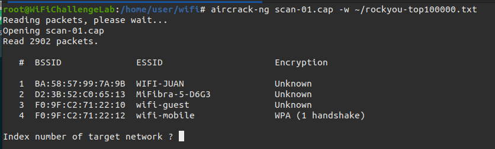

# WiFi Cracking Tools & Techniques
## Hashcat
### Cracking MSCHAPv2
MSCHAPv2 hashes are used in WPA/ WPA2 and WPA3-Enterprise [WiFi](../../networking/wifi/802.11.md) environments. The MSCHAPv2 protocol is password-based, so cracking a MSCHAPv2 hash produces the password used to create it. 

To crack MSCHAPv2, you can use [hashcat](../TTPs/cracking/tools/hashcat.md) in mode *5500* ("Microsoft Challenge Handshake Authentication Protocol v2").
```bash
hashcat -m 5500 hash.txt -a 0 -w 3 rockyou.txt
```
- `-a`: denotes the attack mode which in this case is straight (0)
### Cracking WPA/ WPA2-PSK
Hashcat can also be used to cracking captured WPA/WPA2 handshakes using mode *22000*. To crack with hashcat, you first need to capture a handshake using tools like [Aircrack-ng](Aircrack-ng.md#Aircrack-ng) or [wireshark](../TTPs/recon/tools/scanning/wireshark.md).
```bash
hashcat -m 22000 hash.hccapx -a 0 -w 3 rockyou.txt
```
- `hash.hccapx`: this is the file holding the handshake. It *must be in `hccapx` format*. You can convert `.cap` files to `hccapx` using the `cap2hccapx` tool provided by hashcat

**NOTE:** that this technique is *highly dependent* on the strength of the dictionary wordlist used. Rockyou is pretty outdated so make sure you use a more comprehensive wordlist. Alternatively, you could also look into employing *rule-based* attacks to dynamically modify dictionaries during cracking.
## John
[John the Ripper](../TTPs/cracking/tools/john.md) (john) is another command line tool used to crack hashes and whatnot. It can also be used to *crack MSCHAPv2*. Just like Hashcat, John expects a specific format, in this case the format is:
```bash
USER:$NETNLM$CHALLENGE$RESPONSE
```
To crack MSCHAPv2 with john, the command is:
```bash
john --format=netntlm hash.txt
```
For example:
```bash

root@WiFiChallengeLab:~/tools/john/run# ./john --format=netntlm /root/test.txt 
Using default input encoding: UTF-8
Loaded 1 password hash (netntlm, NTLMv1 C/R [MD4 DES (ESS MD5) 256/256 AVX2 8x3])
Warning: no OpenMP support for this hash type, consider --fork=8
Note: Passwords longer than 27 rejected
Proceeding with single, rules:Single
Press 'q' or Ctrl-C to abort, 'h' for help, almost any other key for status
Almost done: Processing the remaining buffered candidate passwords, if any.
Warning: Only 980 candidates buffered for the current salt, minimum 1008 needed for performance.
0g 0:00:00:00 DONE 1/3 (2026-03-02 19:29) 0g/s 32666p/s 32666c/s 32666C/s user..User1900
Proceeding with wordlist:./password.lst
Enabling duplicate candidate password suppressor using 256 MiB
dragon           (user)     
1g 0:00:00:00 DONE 2/3 (2026-03-02 19:29) 2.273g/s 6745p/s 6745c/s 6745C/s 123456..petey
Use the "--show --format=netntlm" options to display all of the cracked passwords reliably
Session completed
```
## Aircrack-ng
[Aircrack-ng](Aircrack-ng.md) is a suite of wifi pen-testing tools and is known for its ability to crack passwords used in WEP and WPA/WPA2. It is especially effective against PSK-secured networks.
### Cracking WPA/WPA2-PSK
`aircrack-ng` works by capturing network packets. Once it has captured a handshake sent b/w clients and access points, it attempts to crack the PSK by using a provided wordlist.
```bash
aircrack-ng -w /path/to/wordlist.txt -b [BSSID] [capfile.cap]
```
- `-b`: the *[BSSID](../../networking/wifi/802.11.md#Terms)* of the target Access Point and network and the capture file which contains the captured data

When running the command, if you don't specify the *[ESSID](../../networking/wifi/802.11.md#Terms)*, `aircrack-ng` will ask you to choose one:

## Pyrit
[Pyrit](https://github.com/JPaulMora/Pyrit) is a tool used for cracking WPA/ WPA2-PSK. It is an older tool and is apparently being re-written (per the README). Here is a guide for using it to crack things: [How to Use the Command 'pyrit' for WPA/WPA2 Cracking (with examples)](https://commandmasters.com/commands/pyrit-linux/).

Pyrit is cool because it uses both the CPU and GPU to accelerate the cracking process and is apparently good for large wordlist cracking.
### Advantages
- GPU acceleration: Uses CUDA and OpenCL to leverage both NVIDIA and AMD GPUs
- Pre-computed hashes: allows pre-computation of PMKs to speed up cracking
- Scalable: Supports clustering to distribute workload across multiple machines
- Database: stores and manages pre-computed hashes

> [!Resources]
> - [WiFi Challenge Lab](https://academy.wifichallenge.com/courses/take/certified-wifichallenge-professional-cwp/texts/57442709-understanding-wi-fi-cracking-tools-and-techniques)
> - [GitHub - JPaulMora/Pyrit](https://github.com/JPaulMora/Pyrit)
> - [How to Use the Command 'pyrit' for WPA/WPA2 Cracking](https://commandmasters.com/commands/pyrit-linux/)

