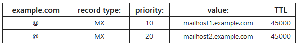

# DNS MX Record
The [DNS](DNS.md) `MX` record ('mail exchange') directs *[email](../email.md) to a mail server*. It indicates how emails should be routed, specifically using the Simple Mail Transfer Protocol [SMTP](../protocols/SMTP.md). 
## Format
`MX` records *must always point to another domain*. It can list *multiple domains* and prioritizes them using a number. Lower numbers are preferred. So, when a server wants to access one of the mail servers listed, it *will always try the lowest num priority first*. If an error is returned from that one, then it will try the next domain in the list.

Additional, lower priority servers are called *backup MX record*.

## Querying Process
Querying `MX` records is done by *Message Transfer Agents* (MTAs). When a user sends an email, the MTA sends a DNS query  to *identify the mail servers of the recipient*. Then, the MTA creates an SMTP connection w/ the mail servers, starting with the priority one.

> [!Resources]
> - [CloudFlare: DNS MX Record](https://www.cloudflare.com/learning/dns/dns-records/dns-mx-record/)

