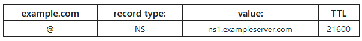

# DNS NS Record
The `NS` DNS record indicates which [DNS server](DNS.md) is the *authoritative nameserver* for that domain. The Authoritative Nameserver is the one which *contains the actural DNS record* for the domain (which maps the domain *to an [IP address](../../PNPT/PEH/networking/IP-addresses.md)*).

This tells you *where to go* to find the domain's IP address. Domains *can have multiple NS records* which indicate *primary and secondary* nameservers for the domain. If the `NS` record isn't configured correctly, then users won't be able to load the domain's webpage (for example)
## NS Record Format:

**NOTE**: NS records *cannot point to [CNAME](CNAME.md) records*.

> [!Resources]
> - [CloudFlare: DNS NS record](https://www.cloudflare.com/learning/dns/dns-records/dns-ns-record/)

