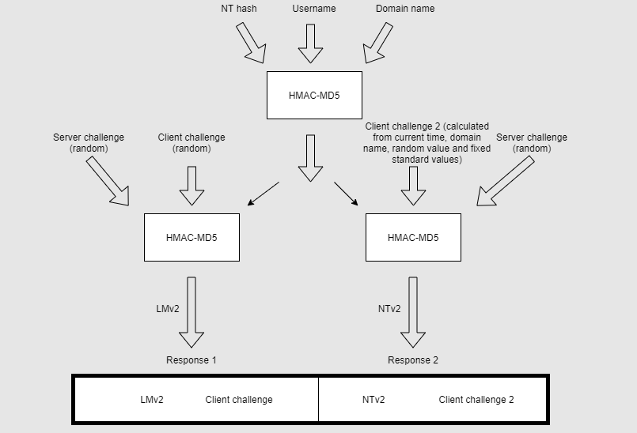

# Windows New Technology LAN Manager
A suite of protocols from Microsoft used to authenticate users and make their activity confidential. It uses a *challenge-response* mechanism where the client has to prove to the server that it knows the password associated w/ a username *w/o passing the password over the network*.
## NTLMv1
NTLMv1 incorporates two hashed password values. Both are stored on the server, and because *neither are salted*, they are used as equivalent values for the actual password. In other words, if you capture the hash from the server, you can use it to authenticate *without actually knowing the password value*. 
### Two Hashes
The two hashes are the *LM Hash* and the *NT Hash*. The LM  hash is a *DES-based* hash where DES is applied to the first *14 characters* of the password. The NT hash is an *MD4* hash of the *little-endian UTF-16 Unicode* version of the password. Both hashes are 16 bytes/ 128 bits each.
### Challenge-Response Mechanism

> [Redlings](https://www.redlings.com/en/guide/ntlm-windows-new-technology-lan-manager)
#### Negotiation
Client machine sends request to a server with the username and other configuration information.
#### Challenge
The server responds by sending the client an 8 byte, randomly generated number.
#### Authenticate
To prove that it knows the password, the client encrypts the random number using the DES algorithm and the NT-hash of the user password as a key (this is the secret *shared b/w the server and the client*)
#### Verify
The server then verifies the user's identity by making sure that the client's reponse is the correct result, i.e. the client's answer matches the value of the original challenge number encrypted with the secret (hashed password).
- It will either use the stored NT-hash from its own database or it will forward the challenge/response pair to the domain-controller for validation.
### Brute Force Attack
NTLM is vulnerable to brute-force attacks b/c the hashing algorithm (DES) does not use a salt. A salt adds random characters to a password before it's hashed, making it more difficult to de-obfuscate.
#### Salting example
1. xxxxxxxxx (password)
2. sha256([salt]password[pepper])

B/c there is no salting of the hashed passwords an attacker can use a [rainbow table](/cybersecurity/TTPs/exploitation/rainbow-table.md) to brute force the hash using pre-calculated hashes of standard passwords. This method is *less effective* on passwords which are more complex and longer (> 15 characters).
### NTLM Relay Attack
Since the user's client has no way or verifying the identity of the server, an attacker can perform a [Man in the Middle (MITM)](/cybersecurity/TTPs/exploitation/MITM.md) by pretending to be the server to the client, and the client to the server.

> [Redlings](https://www.redlings.com/en/guide/ntlm-windows-new-technology-lan-manager)
### Other Vulnerabilities
#### NTLM *does not support MFA*
Multi-factor authentication (MFA) would be a strong defense against NTLM attacks since adding a second authentication step would make it harder for an attacker to authenticate w/ just the password hash. Unfortunately, NTLM doesn't support MFA.
#### Letter casing
During the hashing of a password, all lower case letters are converted to uppercase, so the time-complexity associated w/ cracking the hash is limited. It only takes 2.5 hours to crack an 8-character password (see links).
#### The challenge
The challenge is only a 16-byte random number which is actually not that random (NTLMv1).
#### Uses MD4
Not NTLMv1 and NTLMv2 use the MD4 hashing algorithm which is *considered obsolete*.
## NTLMv2
NTLMv2 (or "Net-NTLMv2") was designed to *replace NTLMv1*. Compared to v1, NTLMv2 has stronger [cryptographic](../../OSCP/password-attacks/README.md) features and increased security by *requiring the server to authenticate to the client* via a [domain-controller](../../computers/windows/active-directory/domain-controller.md) (? not sure this is true, this is hard lol).
### Challenge-Response Mechanism

> [Peter Gabaldon](https://pgj11.com/posts/Playing-With-Windows-Security-Part-1/)
#### Negotiation
When the client sends a request to authenticate, the server responds by sending an 8 byte server challenge which is still a random number.
#### Challenge
Unlike NTLMv1, *two responses* will be generated for the server's challenge, `client challenge 1` and `client challenge 2` (in the above diagram). `client challenge 1` is a random 8-byte number generated by the client. `client challenge 2` is calculated using *the current timestamp*, domain name, a random value, and some fixed standard values.

The addition of the *timestamp* in `client challenge 2` mitigates *replay / relay attacks*. So, the client's job during the challenge is to create two separate responses to the server's challenge. Ultimately, the response package (both responses combined) will be generated like this:
```
v2-Hash = HMAC-MD5(user's NT-Hash, username, domain name)
SC = 8 byte random number (server challenge)
CC1 = 8 te random number  (client challenge 1)
CC2 = (fixed formatting value, timestamp, 8 byte random value, domain name)

LMv2 (response 1) = HMAC-MD5(v2-Hash, SC, CC1)
NTv2 (response 2) = HMAC-MD5(v2-Hash, SC, CC2)

response package = LMv2 | CC1 | NTv2 | CC2
```
##### Challenge 1
The server sends a random number (the server's challenge). The client first encrypts the user's NT hash, username, and the domain name using *HMAC-MD5*. Then it generates a random number (`client challenge 1`).

The client then combines these three things and encrypts them with HMAC-MD5 to create *response 1* to the server's original challenge:
- the already encrypted NT user hash, username, and domain name
- `client challenge 1` (a random number)
- the server's challenge (also a random number)
##### Challenge 2
The server sends a random number (the server's challenge). The client encrypts the user's NT hash, username, and the domain name using HMAC-MD5. THEN it creates its challenge (`client challenge 2`).

The client creates `client challenge 2` by combining the *timestamp*, the domain name, a random value, and some fixed standard values.

Then, the client encrypts with HMAC-MD5 these three things to create *response 2*:
- the already encrypted NT hash, username, domain name combo value
- `client challenge 2` (timestamp, domain name, random value, fixed values)
- the server's challenge (random number)
#### Verify
The two responses (both 16 bytes in length) are combined into a single response packaged which is 24 bytes in length.
## Security
NTLM is vulnerable to a few different attack vectors:


>[!Resources]
> - [Redlings NTLM Authentication](https://www.redlings.com/en/guide/ntlm-windows-new-technology-lan-manager) 
> - [Peter Gabaldon: Playing with Windows Security](https://pgj11.com/posts/Playing-With-Windows-Security-Part-1/)
> - [Wikipedia: NTLM](https://en.wikipedia.org/wiki/NTLM)
> - [Praetorian: NTLMv1 vs NTLMv2](https://www.praetorian.com/blog/ntlmv1-vs-ntlmv2/) (start here if you're confused)

> [!Related]
> - [Cracking NTLM Hashes](../../OSCP/password-attacks/cracking-NTLM.md)