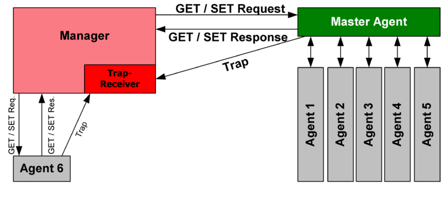
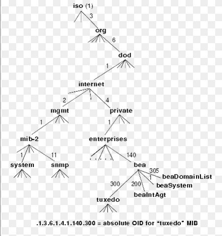

# Simple Network Management Protocol
Protocol used in [application layer](../OSI/7-application/application-layer.md) for *querying [routers](../OSI/3-network/router.md) and [switches](../OSI/2-datalink/switches.md)*. Provides confidentiality by *encrypting data* as well as *authentication* and *integrity* (when using *SNMPv3*).
## Details
SNMP messages are transported using [UDP](UDP.md). An SNMP agent listens for requests on *`port 161`*. SNMP allows for the collection and organization of data on *managed devices* on a network. It also allows you to *modify the information* in order to change the behavior of these devices.

In most implementations, an administrative computer serves as the *'manager'* and monitors/ manages a group of hosts/ devices. The manager has software running on it called *Network Management Station*. Each managed device has an SNMP agent executing on it which reports info (using SNMP) back to the manager. 

Each host/ managed device has an SNMP interface which implements a *read only* access to information specific to that node.

### Agent Software
The agent software (running on *managed devices*) has local knowledge of management information and can translate it to or from SNMP.
### Network Mgmt Station Software
The NMS software (running on the *manager device*) executes applications which *monitor and control* the managed devices. It does the bulk of the processing and provides memory resources for managing the network. 

*One network can have multiple managers.*
## SNMP Management Information Base
The SNMP MIB is a type of database which is organized like a tree. Each branch represents *different organizations or network functions.* The leaves of each branch correspond to different values which can be *accessed by external users*. 
### MIB Tree Example

| MIB Value              | Information Type |
| ---------------------- | ---------------- |
| 1.3.6.1.2.1.25.1.6.0   | System Processes |
| 1.3.6.1.2.1.25.4.2.1.2 | Running Programs |
| 1.3.6.1.2.1.25.4.2.1.4 | Processes Path   |
| 1.3.6.1.2.1.25.2.3.1.4 | Storage Units    |
| 1.3.6.1.2.1.25.6.3.1.2 | Software Name    |
| 1.3.6.1.4.1.77.1.2.25  | User Accounts    |
| 1.3.6.1.2.1.6.13.1.3   | TCP Local Ports  |
This table shows MIB values and their corresponding information type (which they store like variables). Each value corresponds to a specific Microsoft Windows SNMP parameter.
## SNMPv1 & SNMPv2
### Community Strings
v1 and v2 of this protocol use something called 'community strings' to handle authentication. Community strings are like user IDs or passwords which allow access to a device's statistics.

Each string is made up of a user credential and is transported across the network *in plain text* using a GET request. Devices requesting access to another device's statistics have to supply the right community string, or the device will ignore the request.
## SNMPv3
Version 3 of SNMP doesn't change the protocol except to add *encryption* and *authentication.* Unlike v1 and v2, it uses username/password authentication (instead of community strings), and an encryption key.

It also *looks* a lot different than previous versions because it adds new textual conventions, terminology and concepts. For example, SNMPv3 has *security and remote configuration enhancements*.
### DES-56
Only recently has SNMPv3 been improved to use AES-256 encryption instead of DES-56. DES-56 is considered *weak encryption* and can be brute forced easily.

> [!Resources]
> - [Wikipedia: SNMP](https://en.wikipedia.org/wiki/Simple_Network_Management_Protocol)
> - [`RFC 1157`](https://datatracker.ietf.org/doc/html/rfc1157)

> [!Related]
> - `port 161` ([UDP](UDP.md))
> - [My OSCP notes on SNMP enum](../../OSCP/Enumeration%20&%20Info%20Gathering/active/SNMP-enum.md)