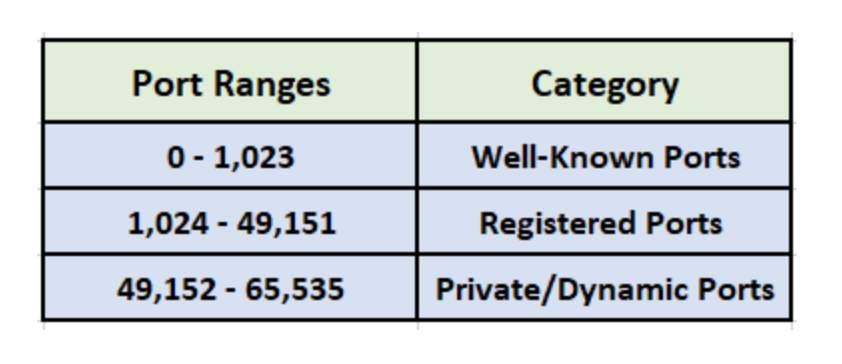

# Ports
Ports are used to *uniquely specify services and applications* running on a device. Ports enforce what data can come in or leave from them and how. They're also used with [firewalls](../../cybersecurity/defense/firewalls.md) to block or allow certain connections to a device. Can also be used by networking devices to enforce strict rules on communication b/w devices on or outside a network.
## Port Ranges
There are 65,536 ports (starting from port 0) and they are generally split into two different types. The first 1023 are *well known ports* and are *associated with specific services* and protocols.

The rest are "dynamic" or "ephemeral" ports which are *temporarily assigned* to applications and protocols. Of the dynamic ports, 1,024 to 49,151 are *registered* and the rest are *private*.

The private range ports are usually used on an "as needed basis" and temporarily.

### Common Ports

Of the first 1023 ports, these are the most common and their protocols are *worth knowing*.

These ports follow standards, which means you can administer applications which interact with these protocols on different, non-standard ports, but if you do *you should include a `:`*. This is because more applications will default to using the standard port for whatever protocol.

## Port Forwarding 
If a device running a service on a port inside the intranet of a network wants to make that service available to the public internet, or to another [subnet](../../PNPT/PEH/networking/subnetting.md) it can do so with port forwarding. Port Forwarding is normally *configured by a router*.

In the below picture, the device at `192.168.1.10` is running a service on port 80. Only the other devices *w/i the same intranet* can access it:

> [TryHackMe](https://tryhackme.com/module/network-fundamentals)

To Port Forward the service so *other devices on other networks can access it*, port forwarding can be used on the router. The routing would look more like this:

> [TryHackMe](https://tryhackme.com/module/network-fundamentals)

Port 80 on the network device *gets forwarded to the router*, so for other devices to access it, the address they access is `82.62.51.70:80`.

> [!Resources]
> - [TryHackMe: Network Fundamentals](https://tryhackme.com/module/network-fundamentals)
> - Internship learning material