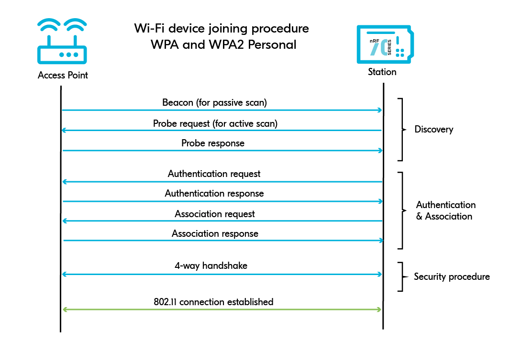
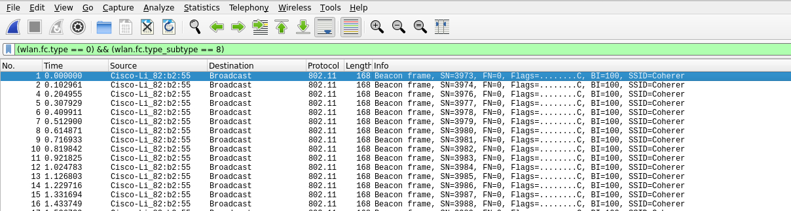
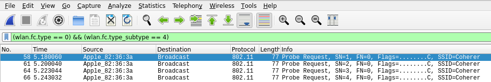
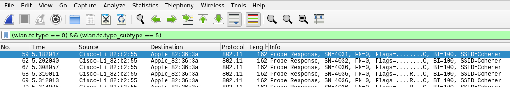
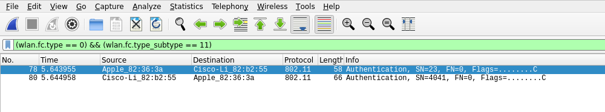
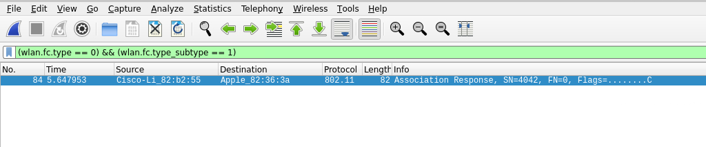
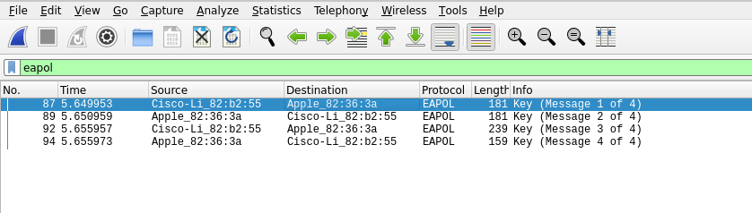
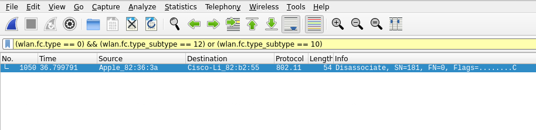

# IEEE 802.11
IEEE 802.11 is a set of standards for [LAN](../design-structure/LAN.md) networking that specifies [MAC-layer](../OSI/2-datalink/MAC-layer.md) and physical layer protocols for implementing *wireless local area network* (WLAN) computer networking. 
The 802.11 standard uses various [radio](../../cybersecurity/hardware-hacking/radio-frequency.md) frequencies including 2.4GHz, 5GHz, 6GHz, and 60GHz among others. The allowed spectrum varies by region/ regulatory domain.
## IEEE 802.11 MAC Frame
All frames in 802.11 use [MAC-layer](../OSI/2-datalink/MAC-layer.md) framing which consists of nine fields:
1. *Frame Control*: includes info such as type, subtype, protocol version, distribution system (ds), from DS, Order, etc.
2. *Duration/ID*: an ID that clarifies the amount of time the segment is occupied
3. *Address 1,2,3 and 4*: Usually store the MAC addresses involved in the communication (depending on the origin of the frame). May include the *BSSID* of the access point, the client's MAC address, etc.
4. *SC* (Sequence Control Field): Used to prevent duplicate frames
5. *Data*: Holds the data being transmitted from the sender to the receiver
6. *CRC* (Cyclic Redundancy Check): Contains a 32-bit checksum to help detect errors
### Frame Types
IEEE frames are categorized based on what they do or what actions they are involved in:
- *Management (00)*: Used for management and control and for allowing the access point and client to control the connection
- *Control (01)*: Quality control for managing the transmission and reception of the data with in the frame
- *Data (10)*: Contain the data being transmitted
#### Sub-types of Management Frames
In wifi pen-testing, most of the focus is on the *management frames* since they are used to control the connection b/w the access point and client. There are five sub-types of management frames:
1. Beacon Frames (1000)
2. Probe Request (0100) and Probe Response (0101)
3. Authentication Request and Response (1011)
4. Association/ Reassociation request and response (0000, 0001, 0010, 0011)
5. Disassociation/Deauthentication (1010, 1100)
##### Beacon Frames (1000)
These are primarily used by the access point to *communicate its presence* to clients/ stations. The frame includes information including supported ciphers, auth types, SSID, supported data rates, etc..
##### Probe Requests and Responses (0100, 0101)
Sent between a potential client and an access point. A client will send a probe request containing the *SSID of the access point*. The access point will then respond to the client w/ information about itself.
##### Authentication Req/Resp (1011)
Sent by the client to the access point to begin the connection. Primarily includes *information to identify the client* to the access point.
##### Association/Reassociation (0000, 0001, 0010, 0011)
Once the authentication request is sent and the client has undergone the auth process, the client sends an association request to the access point. The access point responds w/ an ass. response which indicates *whether the client is allowed to associate or not*.
##### Disassociation/Deauth (1010, 1100)
These are sent from the AP to the client and they are designed to *terminate the connection*. These frames include a *Reason Code* which tells why the client is being disconnected.
- Abused in handshake capturing and DoS-based attacks
### Connection Cycle (WPA2)

#### Examining with Wireshark
To better understand this cycle, we can capture a handshake using [wireshark](../../cybersecurity/TTPs/recon/tools/scanning/wireshark.md) and examine the packets. After capturing traffic, we can use the following filter to filter for *Beacon frames* from the access point:
```
(wlan.fc.type == 0) && (wlan.fc.type_subtype == 8)
```

Filtering for *Request frames* can be done using this filter:
```
(wlan.fc.type == 0) && (wlan.fc.type_subtype == 4)
```

To filter for *Probe response* frames from the access point, we can use this filter:
```
(wlan.fc.type == 0) && (wlan.fc.type_subtype == 5)
```

To filter for *Authentication frames* b/w the client and the access point we can use this filter:
```
(wlan.fc.type == 0) && (wlan.fc.type_subtype == 11)
```

And to filter for *Association response* frames:
```
(wlan.fc.type == 0) && (wlan.fc.type_subtype == 1)
```

If the network is using WPA2, then we can filter for *EAPOL* (handshake) frames with the following filter:
```
eapol
```

Once the connection is complete, we can use the following filter to find out which party *initiated the disconnection* (the access point or the client):
```
(wlan.fc.type == 0) && (wlan.fc.type_subtype == 12) or (wlan.fc.type_subtype == 10)
```



> [!Resources]
> - [Wikipedia: 802.11](https://en.wikipedia.org/wiki/IEEE_802.11)
> - [HTB Academy: Wifi Pentesting Basics](https://academy.hackthebox.com/module/222/section/2404)

