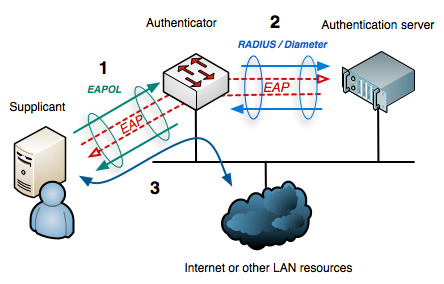

---
aliases:
  - MGT
---
# 802.1X Authentication
`802.1X` is an IEEE standard for controlling [wifi](802.11.md) network access. It standardizes three main components:
- supplicant: (the client connecting)
- authenticator: (the access point)
- authentication server: (usually a *RADIUS server*)
`802.1X` is used in *MGT networks* and allows them to use unique authentication for each client where each client uses their own username and password for authentication.

## Authentication Process
The authentication process follows these steps:
1. EAPOL (EAP over LAN): Initial communication b/w the client and authenticator
2. RADIUS/Diameter: the authenticator forwards the client's credentials to the authentication server using RADIUS or Diameter protocols
3. Network access: If the authentication server successfully validates the client's credentials, the authenticator grants them access to the network, including to [LAN](../design-structure/LAN.md) resources and the internet
### EAP
Extensible Authentication Protocol (EAP) is an auth framework that supports multiple auth methods:
##### PAP
Password Authentication Protocol: password sent in clear text. One of the least secure methods.
##### CHAP
Challenge-Handshake Auth Protocol: uses a challenge-response process to authenticate.
##### MSCHAPv2
Improved version of Microsoft's Challenge-Handshake auth protocol. Provides mutual authentication b/w client and server and uses a more secure algorithm to *encrypt the password*.
##### GTC
Generic Token Card: clients sends their username and password in clear text.
##### Client Certificate
*Most secure method*: both the server and client use digital certificates to auth each other. This is the *only option* for EAP-TTLS, EAP-TLS, and some versions of PEAP.
### EAP Handshake
EAP auth methods can be divided into two major categories:
- EAP with Client Certificate Authentication (e.g., EAP-TLS, PEAPv0 (EAP-TLS)):
- EAP with Credential Authentication (e.g., LEAP, PEAPv0 (MSCHAPv2), EAP-TTLS (MSCHAPv2), etc.). EAP authentication processes can be broken down into two phases:
    - Phase 1: The server authenticates using a certificate (or a PAC in EAP-FAST), and a secure TLS tunnel is established.
    - Phase 2: The client authenticates using a credential-based authentication method such as MSCHAPv2, CHAP, PAP, GTC, etc.

Below are several common types of EAP handshakes:
- **EAP-MD5** is one of the simplest EAP methods. It relies on an MD5 hash to authenticate users but is vulnerable to several attacks. (OBSOLETE)
- **LEAP**, or Lightweight Extensible Authentication Protocol, was developed by Cisco. It uses a combination of passwords and encrypts credentials but has been vulnerable to dictionary attacks. (OBSOLETE)
- **EAP-TLS** uses client and server certificates to securely authenticate both parties. It is one of the most robust and secure EAP methods but also one of the most complex to implement due to the need for a PKI infrastructure.
- **EAP-FAST**, developed by Cisco, is similar to EAP-TLS but uses a PAC (Protected Access Credential) instead of certificates for authentication. This reduces implementation complexity while maintaining a good level of security.
- **EAP-TTLS** creates a secure channel like EAP-TLS but allows the use of simpler authentication methods within the secure tunnel, such as PAP, CHAP, or MSCHAPv2 in addition to TLS.
- **PEAP**, or Protected Extensible Authentication Protocol, is similar to EAP-TTLS and allows the use of simpler authentication methods within a secure TLS tunnel.

> [!Resources]
> - [WifiChallengeAcademy](https://academy.wifichallenge.com/)

> [!Related]
> - [MGT attacks](../../CWP/MGT-attacks/README.md)