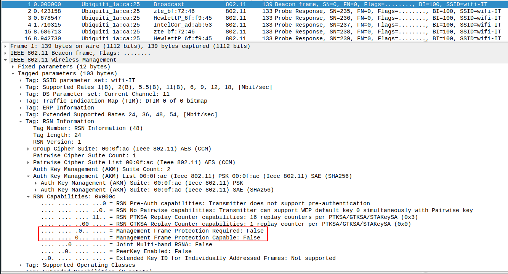

# Management Frame Protection
MFP was introduced to the [802.11](802.11.md) standard to protect management frames against spoofing. 
## Management Frames
Management frames refer any frames which work to either initiate or terminate sessions between clients and the AP in Wi-Fi networks. They include:
- authentication frames
- de-authentication frames
- association frames
- dissociation frames
- beacon frames
- probe frames

Unlike frames containing data (which can be encrypted to provide confidentiality) all of these frames *must be heard and understood by all clients* and are therefor transmitted *in cleartext*.

Because they are transmitted in cleartext, they need to be *protected from forgery* and other attacks. Otherwise, attackers can spoof them in attacks against the AP and clients like in [deauthentication attacks](../../CWP/PSK-attacks/handshake-attack.md#2.1%20Force%20traffic).
## MFP
MFP protects *certain* management frames by using cryptographic authentication. The keys that encrypt the frames are derived *during the handshake*. Unfortunately, *only some  management frame types can be protected*. Protected frames include:
- Deauthentication
- Disassociation
- Robust action frames
Frames that cannot be protected include:
- Beacon frames
- Probe requests/responses
- Authentication
- Association requests
These must remain open so devices can discover networks.
### Verifying MFP
After capturing network traffic, you can inspect the traffic in [wireshark](../../cybersecurity/TTPs/recon/tools/scanning/wireshark.md) and look for a *beacon frame*. In the beacon frame, look for `IEEE 802.11 Wireless Management` --> `Tagged parameters` --> `RSN Information` --> `RSN Capabilities`. In this field there should be two binary values:
- MFPC: **0** = not capable, **1** = capable.
- MFPR: **0** = not required, **1** = required.

> [!Resources]
> - [Cisco: Management Frame Protection](https://www.cisco.com/c/en/us/td/docs/wireless/controller/9800/17-18/config-guide/b_wl_17_18_cg/m_mfp.pdf)
> - [802.11w Management Frame Protection MFP - Cisco Meraki Documentation](https://documentation.meraki.com/Wireless/Design_and_Configure/Architecture_and_Best_Practices/802.11w_Management_Frame_Protection_MFP)