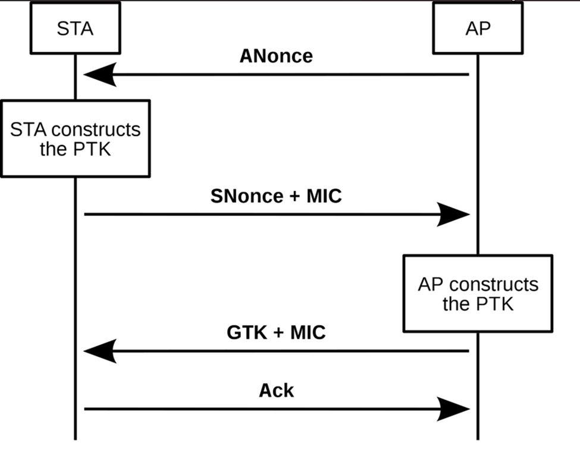

---
aliases:
  - WPA
  - WPA2
  - WPA/WPA2
---
# WPA and WPA2
WPA and WPA2 are authentication types for [WiFi](802.11.md) networks. They both use a *pre-shared key* (PSK) for authentication, but during the handshake the PSK *isn't transmitted over the wire*. Instead, the handshake includes a challenge request type process.
## Authentication

- **Message 1:** the access point (AP) initiates the handshake by sending an `EAPOL-Key` frame to the client. The frame includes a *randomly generated nonce* called the `ANonce`. The nonce is used in the key generation process
- **Message 2:** The client responds with a second `EAPOL-Key` frame which carries its own nonce (`SNonce`) as well as a `MIC` for integrity. To create the `MIC`, the client combines the two nonces, the [MAC](../OSI/2-datalink/MAC-addresses.md) address of the station and the AP, and the `PMK` to create a `PTK`.
- **Message 3:** Once the AP receives the `MIC`, it responds with another `EAPOL-Key` frame. This frame contains the Group Temporal Key (GTK) which is *encrypted with the `PTK` and `MIC`*. The AP also calculates the `PTK` to ensure that both parties have matching keys.
- **Message 4:** The client sends a final `EAPOL-Key` frame to the AP as an acknowledgement that the client successfully received the `GTK` and that both the client and AP derived the same `PTK`.
## PMKID
`PMKID` refers to the Pairwise Master Key (PMK) which is used in some WPA2 networks. The `PMKID` is vulnerable to attack because if an attacker captures it, they *don't need a full 4 way handshake* to compromise the networks security. 

The `PMKID` is calculated during a Robust Security Network (RSN) handshake as follows:
```bash
PMKID = HMAC-SHA1(PMK, "PMK Name" + MAC_AP + MAC_Client)
```
- `PMK`: The Pairwise Master Key which is derived by combining the `PSK` and the `SSID` using the `PBKDF2` function
- `PMK Name`: A fixed, standardized string used in the HMAC function to ensure compatibility across devices
- `MAC_AP` & `MAC_Client`: the MAC addresses of the access point and the client attempting to connect

Once the `PMKID` is calculated, its included in the *first frame of the 4-way handshake*. An attacker can capture the `PMKID` and the perform offline brute-forcing to uncover the `PSK`. Most brute force attacks compare a guessed `PSK` to the PMK which is recalculated. The resulting `PMKID` is compared to captured one, and if they match, the PSK is correct.

> [!Resources]
> - [PMKID Attacks: Debunking the 802.11r Myth | NCC Group](https://www.nccgroup.com/research/pmkid-attacks-debunking-the-80211r-myth/)
> - [Wifi Challenge Academy](https://academy.wifichallenge.com/)

